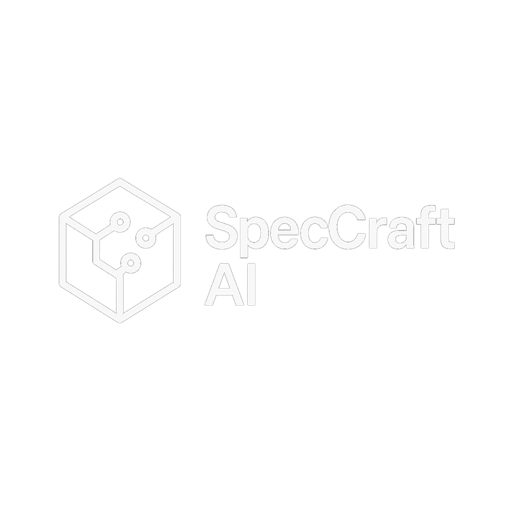
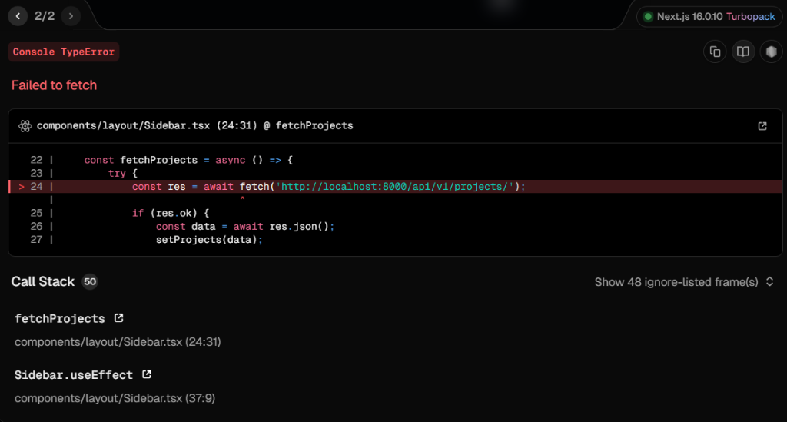
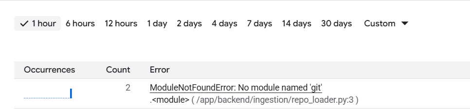
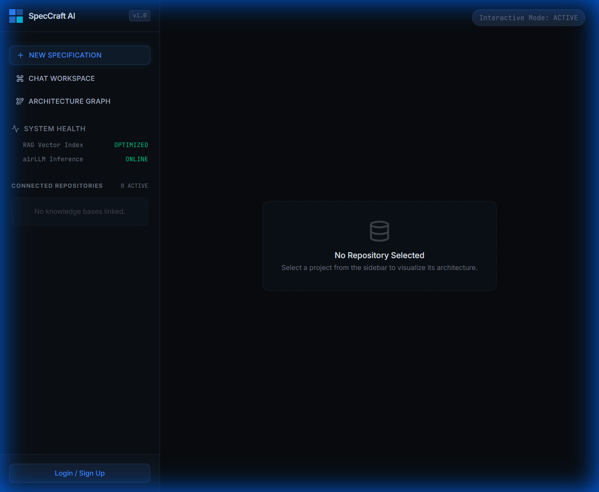
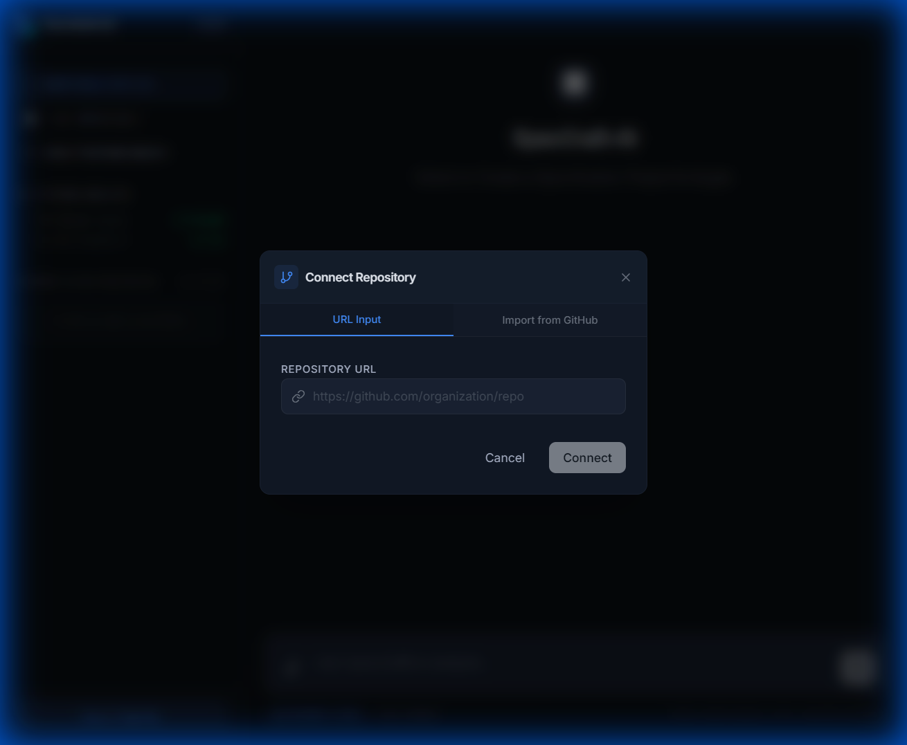

# SpecCraft AI 🚀

<div align="center">
  
  <h1>SpecCraft AI</h1>
  <p><strong>The Autonomous Software Architect.</strong></p>
  <p>Analyze, document, and interact with your codebase using advanced RAG, Static Analysis, and Architecture Graphs.</p>

  [](LICENSE)
  []()
  
  
  
  
  
</div>

---

## 🌟 Introduction

**SpecCraft AI** is a state-of-the-art developer tool designed to bridge the gap between complex codebases and human understanding. By combining **Retrieval-Augmented Generation (RAG)** with **Static Analysis** and **Architecture Graphs**, SpecCraft AI turns any Git repository into an interactive, queryable, and visualizable knowledge base.

Whether you're onboarding new engineers, debugging legacy spaghetti code, or generating architectural documentation, SpecCraft AI is your intelligent companion.

## ✨ Key Features

- **🧠 Context-Aware Chat (RAG)**: Chat with your codebase using natural language. Query specific files, Ask about architectural patterns, or debug errors with context.
- **🕸️ Interactive Architecture Graph**: Visualize your project's structure, dependencies, and file relationships in a stunning 3D/2D interactive graph.
- **⚡ Real-Time Ingestion**: Connect any GitHub repository and watch as SpecCraft indexes it in seconds (using synchronous processing for reliability).
- **🔐 Enterprise-Grade Security**: Secure authentication via Supabase (Google & GitHub OAuth), ensuring your intellectual property remains safe.
- **🛠️ Tech-First UX**: Dark-mode native, terminal-inspired aesthetics designed for developers.
- **☁️ Cloud Native**: Fully containerized and deployed on Google Cloud Run for infinite scalability.

## 📸 Interface Gallery

<table align="center">
  <tr>
    <td align="center"><strong>Analyst Dashboard</strong></td>
    <td align="center"><strong>Context-Aware Chat</strong></td>
  </tr>
  <tr>
    <td></td>
    <td></td>
  </tr>
  <tr>
    <td align="center"><strong>Architecture Graph</strong></td>
    <td align="center"><strong>Live Ingestion Log</strong></td>
  </tr>
  <tr>
    <td></td>
    <td></td>
  </tr>
</table>

## 🏗️ Technical Architecture

SpecCraft AI follows a modern, decoupled microservices architecture designed for performance and scalability.

```mermaid
graph TD
    User[User] -->|HTTPS| Frontend[Next.js Frontend]
    Frontend -->|Auth (JWT)| Supabase[Supabase Auth]
    Frontend -->|API Calls| Backend[FastAPI Backend (Cloud Run)]
    
    subgraph "Backend Core"
        Backend -->|Clone & Parse| Ingestion[Ingestion Engine]
        Backend -->|Vector Search| PgVector[(Supabase pgvector)]
        Backend -->|LLM Inference| Gemini[Google Gemini Pro]
        Ingestion -->|Extract AST| TreeSitter[Tree-Sitter Parsers]
    end
    
    subgraph "Data Storage"
        Ingestion -->|Store Metadata| Postgres[(PostgreSQL DB)]
    end
```

### **1. Frontend (The Console)**
- **Framework**: Next.js 14 (App Router)
- **Styling**: TailwindCSS + Framer Motion (Glassmorphism & Neon accents)
- **State**: React Hooks + Supabase Auth Helpers
- **Visuals**: React Force Graph for architecture visualization

### **2. Backend (The Core)**
- **Framework**: FastAPI (High-performance Async Python)
- **AI/ML**: Google Gemini Pro (LLM), Sentence-Transformers (Embeddings)
- **Vector DB**: Supabase `pgvector`
- **Ingestion**: GitPython + Tree-Sitter (AST Parsing) for deep code understanding
- **Deployment**: Google Cloud Run (Serverless Container) with 4GiB RAM / 2 vCPUs

## 🚀 Workflow

1. **Connect Repository**: User provides a Git URL (e.g., GitHub).
2. **Synchronous Ingestion**: 
   - Backend clones the repo to ephemeral storage (`/tmp`).
   - `Tree-Sitter` parses code to extract classes, functions, and imports.
   - Embeddings are generated for each code chunk.
3. **Graph Construction**: Import relationships are analyzed to build a directed graph of the architecture.
4. **Interactive Querying**: 
   - User asks a question in the chat.
   - System performs vector similarity search to find relevant code chunks.
   - LLM generates an answer grounded in the retrieved code.

## 💻 Getting Started

### Prerequisites
- Docker & Docker Compose
- Python 3.10+
- Node.js 18+
- Supabase Project Credentials

### Installation

1. **Clone the repository**
   ```bash
   git clone https://github.com/your-org/speccraft-ai.git
   cd speccraft-ai
   ```

2. **Frontend Setup**
   ```bash
   cd frontend
   npm install
   # Create .env.local with Supabase keys
   npm run dev
   ```

3. **Backend Setup**
   ```bash
   cd backend
   pip install -r requirements.txt
   # Set up .env with DB and API keys
   uvicorn main:app --reload
   ```

## 🔒 Security & Performance

- **Authentication**: All API endpoints are protected via **JWT tokens** issued by Supabase.
- **Resource Isolation**: Each project's vector index is isolated by `project_id`, ensuring strictly scoped queries.
- **Memory Optimization**: Backend runs on optimized Cloud Run instances (4GiB) to handle large repository indexing without OOM errors.
- **Ephemeral Storage**: Cloned repositories are processed in temporary storage and cleaned up immediately, maintaining a stateless and secure environment.

## 🤝 Contributing

Contributions are welcome! Please check the `CONTRIBUTING.md` for guidelines on how to get started.

## 📜 License

This project is developed and maintained by **STiFLeR7**.
Licensed under the MIT License - see the `LICENSE` file for details.

---
<div align="center">
  <sub>Built with ❤️ by <strong>STiFLeR7</strong></sub>
</div>
